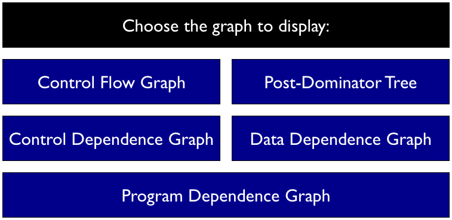

#Program Dependence Graph
#### [UvA](http://www.uva.nl/en/home) [Software Engineering Master](http://www.software-engineering-amsterdam.nl/) Project

### Contributors:
* [Lulu Zhang](http://github.com/lulu516)
* [Vadim Zaytsev](http://github.com/grammarware)

----------

In order to run the tests successfully, [JavaTest](https://github.com/lulu516/JavaTest) should also be imported into Eclipse. You can start this project with a smile face via running `showGraphs(|project://JavaTest/src/PDG/Sum.java|, 0);` (first, `import Visualization::Vis;`)

